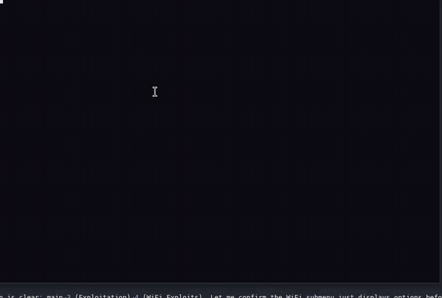
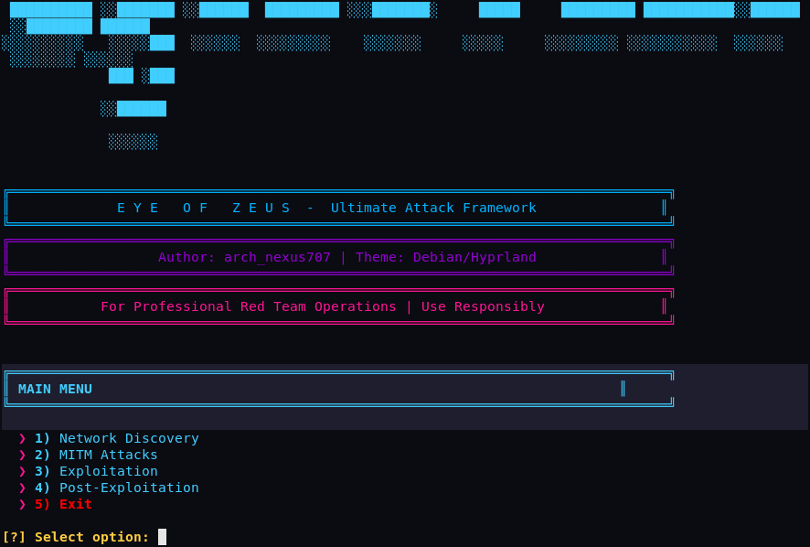
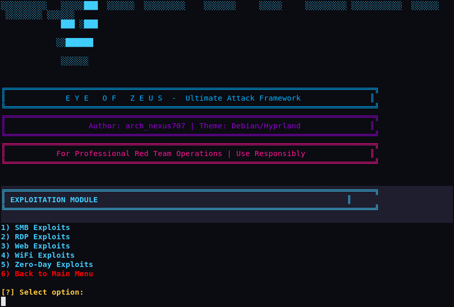
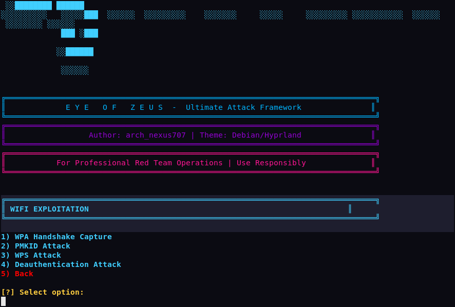

# Eye of Zeus

A terminal menu for the network testing tools I reach for most, wired together
so I don't have to remember every flag. It's a bash front-end that shells out to
the usual suspects (nmap, bettercap, aircrack-ng, metasploit, hcxtools and
friends) for discovery, MITM, exploitation and post-exploitation. Built and run
on Kali.

Author: arch_nexus707

## Demo



| Main menu | Exploitation | WiFi |
| --- | --- | --- |
|  |  |  |

## Before you use it

Only point this at networks and devices you own or have written permission to
test. Scanning, intercepting or attacking anything else is illegal pretty much
everywhere (CFAA in the US, Computer Misuse Act in the UK, and so on) and the
penalties are real. I take no responsibility for what you do with it. No
permission, no testing. That's the whole rule.

## What's in it

- Network discovery: ping sweep, deep OS/service scan, ARP scan, WiFi AP discovery
- MITM: ARP/DNS spoofing, SSL strip, session hijack, captive portal, evil twin
- Exploitation: SMB/RDP/web exploits, WiFi (handshake, PMKID, WPS, deauth), searchsploit lookup
- Post-exploitation: persistence, exfil, privilege escalation, lateral movement

Two scripts:

- `Eye_Of_Zeus_2.sh` is the full thing, and what you probably want.
- `Eye_Of_Zeus.sh` is an older standalone ARP-MITM + sniffing workflow.

## Running it

```bash
git clone https://github.com/archnexus707/Eye_Of_Zeus.git
cd Eye_Of_Zeus
chmod +x Eye_Of_Zeus_2.sh
sudo ./Eye_Of_Zeus_2.sh
```

Needs root and Kali (or something close). On first launch it checks for the
tools it uses and offers to `apt install` whatever's missing. `Eye_Of_Zeus.sh`
also opens `xterm` windows, so it needs an X display and won't work over plain
SSH.

Everything is numbered menus. The long-running attacks (ARP spoof, SSL strip,
captive portal, evil twin, deauth) keep going until you hit Ctrl+C, which puts
things back (IP forwarding off, iptables rules removed, monitor mode stopped)
and drops you back at the menu.

## A few things worth knowing

- The PMKID capture is written for hcxdumptool 6.3.0 and up, including 7.x. That
  means BPF filters (`--bpf`) and `--rds` for the live view, and letting
  hcxdumptool own the interface, so don't put the card into monitor mode first.
  Older builds used `--filterlist_ap` and `--enable_status`, which is what the
  script used to do before this broke on newer Kali.
- The SMBGhost exploit path is looked up with `searchsploit -p` at runtime
  instead of being hardcoded, since exploit-db moves things around between
  releases. Wordlists under `/usr/share/wordlists` still shift around, so check
  those yourself.
- `sslstrip` is Python 2 and recent Kali dropped it. If it's gone, use
  bettercap's SSL-strip caplet instead.

## License

MIT. See [LICENSE](LICENSE).
